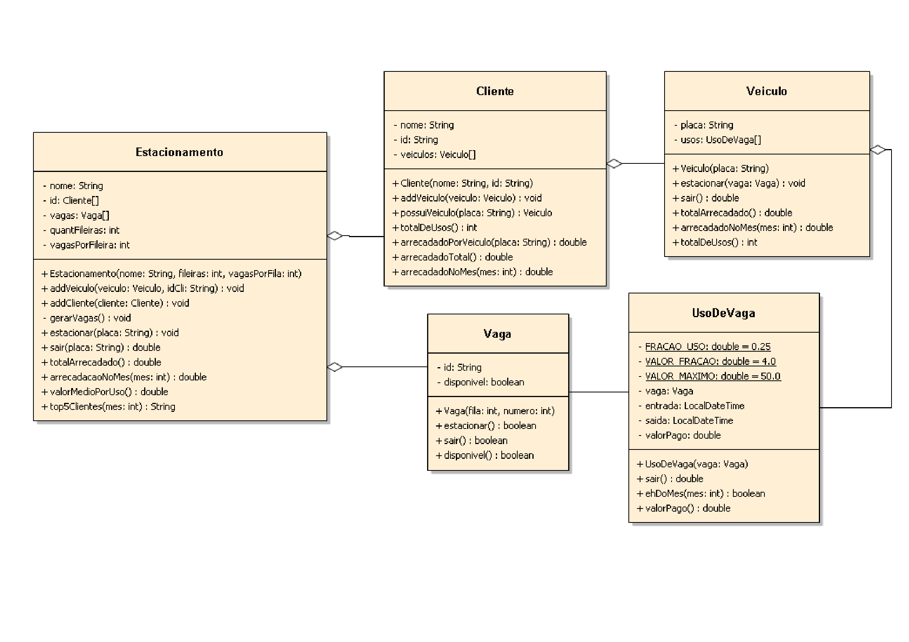

# Gerência de Estacionamentos

## Xulambs Parking

O objetivo deste projeto é desenvolver um sistema de software para a Xulambs Inc. que gerencie seus estacionamentos. O sistema permitirá controle de vagas, registro de veículos e clientes, cobrança de uso por tempo, acesso ao histórico de uso e fornecimento de informações financeiras para a direção da empresa.

## Diagrama Inicial

_QUALQUER modificação neste modelo só pode ser feita após negociação com os analistas do projeto._

## Requisitos

- A Xulambs Parking pretende contar com entre 1 a 3 parques de estacionamento na cidade.

### Veículo

- Os veículos que usarão o estacionamento serão registrados por **placa** e devem estar ligados a clientes.

### Cliente

- O cliente pode ser identificado com **nome** e **identificador** ou como "anônimo" (nome e identificador **neutros**).
- Um cliente pode ter cadastrado para si **mais de um** veículo.
- Um cliente identificado tem acesso a seu histórico de uso do estacionamento.
  - Este histórico pode ser completo ou filtrado por datas de início e fim.

### Estacionamento e Vaga

- Cada parque de estacionamento terá um número pré-determinado de vagas.
  - As vagas serão identificadas **alfanumericamente**, por exemplo: vaga Y08 (fila Y, vaga 8).
- O uso do estacionamento envolve a seleção de uma vaga livre e a ocupação desta. A cobrança é feita por frações do tempo e segue essas regras:
  - **R$4,00** a cada **15 minutos**
  - valor limite: **R$50,00**
- Uma vaga **não** pode ser utilizada por dois clientes ao mesmo tempo.

### Direção

A direção precisa ter acesso às seguintes informações:

- Valor total arrecadado do estacionamento
- Valor arrecadado em determinado mês
- Valor médio de cada utilização do estacionamento
- Ranking dos clientes que mais geraram arrecadação em um determinado mês

## Sistema

Deverá ser criado um sistema simples, em console, para dar acesso a todas as funcionalidades explicitadas
pelos requisitos acima.

## Alunos integrantes da equipe

- Ana Luiza Machado Alves
- Ana Luiza Santos Gomes
- Octávio Walter Rattes Soares
- Victor Hugo Criscollo Moreira

## Professores responsáveis

- João Caram Santos de Oliveira
